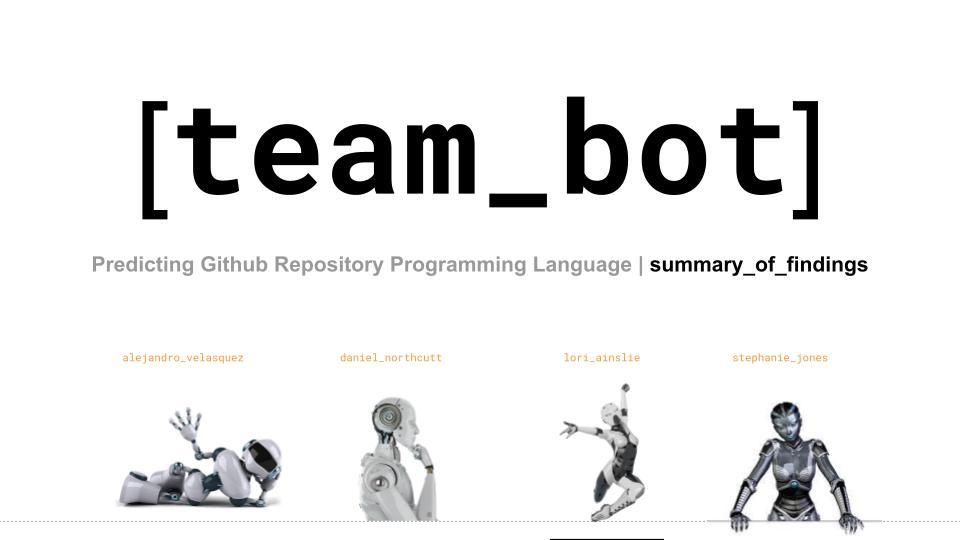

# Using Classification To Predict Programming Language
## Table of Contents

1. [Project Planning / About The Project](#project-planning--about-the-project)

2. [Acquisition](#acquisition)

3. [Preparation](#preparation)

4. [Exploration](#exploration)

5. [Modeling](#modeling)

6. [Delivery / Conclusion](#delivery--conclusion)

## Project Planning / About The Project

### Project Goal

* To build a classification model that can predict the programming language of a repository based on the text of the repository's `README.md` file.

### Project Description

For this project, we scraped data from GitHub repositories about Bots and built models to predict the programming language based on the README contents.

Having a model that classifies observations based on text data collected is a great tool and can be applied in many business situations to provide valuable insights.

### Initial Hypotheses/Questions

* Which language is represented most frequently in the data?

* Is there any correlation between character and word count?

* Is there a difference in average word count or character count among the languages?

* Are any of the top 25 words found across all the languages?

### Data dictionary

Target | Dtype | Description
:-- | :-- | :--
`language` | object | description

Model Feature | Dtype | Description
:-- | :-- | :--
`repo` | object | Name of GitHub repo used to extract data
`readme_contents` | object | Repo's README.md 
`clean` | object | remove any inconsistencies in unicode characters from readme_contents. Converted the resulting string to the ASCII character set and turned the resulting bytes object back into a string 
`lemmatized` | object | turns data in `clean` into root words, also known as the lemma 
`word_count` | int64 | counts the words in the `lemmatized` column 
`char_count` | int64 | counts the characters in the `lemmatized` column 

Language | Description
:-- | :--
`Python` |  an interpreted, object-oriented, high-level programming language with dynamic semantics
`JavaScript` | object-oriented computer programming language commonly used to create interactive effects within web browsers
`C#` |  is a general-purpose, multi-paradigm programming language
`TypeScript` | language developed and maintained by Microsoft. It is a strict syntactical superset of JavaScript and adds optional static typing to the language
`Java` | Java is a general-purpose programming language that is class-based and object-oriented

[Trello Board](https://trello.com/b/KFt1reNg/githublanguage-prediction)

## Acquisition

* Deliverable: acquire.py module
* Create function for scraping github, caching, and reading in data
* Save functions to an acquire.py for importing
* Test functions

## Preparation

* Deliverable: prepare.py module
* Create function that cleans data
  * Drop nulls and remove results in languages other than English
  * Lowercase all letters
  * Normalize text
  * Create columns for stemmed data and lemmatized data 
  * Remove stopwords
* Create function that splits data into train, validate, and test samples
  * Split 20% (test), 24% (validate), and 56% (train)
* Save functions to a prepare.py for importing
* Test functions

## Exploration

* Ask questions/form hypotheses
  * Which language is represented most frequently in the data?
  * Is there any correlation between character and word count?
  * Is there a difference in average word count or character count among the languages?
  * Are any of the top 25 words found across all the languages?
* Explore using visualizations
  * Create wordclouds
  * Explore term frequencies
  * Explore ngrams
* Use statistical tests to test hypotheses
* Document answers to questions and takeaways
  * Python is the language most frequently used for bot projects. It is the primary language for almost half of the repositories represented in the data.
  * There is a positive correlation between character count and word count. Python and JavaScript have the highest counts.
  * In the plotted graphs, there do appear to be a differences in average character and word count but statistical testing shows that this difference is not statistically significant
  * 'Bot', 'use', and 'using' are top words found across all the languages.
* Key takeaways:
  * Python and JavaScript are the most popular programming languages for bot projects. Both languages have the highest character and word counts. Average word count or character counts by language are not statistically different, therefore, not good features to use for modeling.

## Modeling

* Establish a baseline using mode
* Determine evaluation metric: accuracy
* Build, fit and use models to make predictions
* Compute evaluation metrics to evaluate models' performance
* Select best model and use and evaluate on test dataset
* Document takeaways

## Delivery / Conclusion

* Create Google Slides presentation
* Create final notebook
* Present via Zoom
* Audience will be a general audience

### Recommendations and Next Steps

* The recommendation is to apply this model to larger datasets as we discovered that categories with less representation in smaller datasets do not hold much weight in the predictions. Therefore, all new data is classified as only those categories most prevalent in the data.

* With more time and resources, we would like to do more feature engineering to see if ngrams or other word combinations would be better predictors of language.

### Steps to Recreate:

* Make a github personal access token.
  1. Go here and generate a personal access token https://github.com/settings/tokens (don't need to select any scopes)
  2. Create an env.py file in your working directory 
  3. Save the personal access token in your env.py file under the variable `github_token`
  4. Add your github username to your env.py file under the variable `github_username`
* Create a gitignore and add your env file to prevent your credentials from getting pushed to Github
* Download the aquire.py and prepare.py files to your working directory
* Download the 00_final_report.ipynb notebook to your working directory
* Read this README.md
* Run the 00_final_report.ipynb notebook

### ALL STAR TEAM REPRESENT!!!
